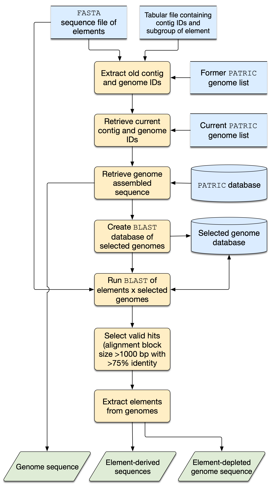

# GRES - Genome Retriever and Element Subtractor tool

## Introduction
The gres.py script is a Genome Retriever and Element Subtractor tool designed for retrieving genomes and extracting elements from them. This README provides detailed instructions on the installation, requirements, and usage of the gres tool.




 The program uses as input files a set of element sequences in FASTA format and three spreadsheets in CSV format. These spreadsheets contain the identifiers of the genomes containing the elements, the respective scientific names of the organisms, the subgroups to which the elements belong (e.g. subfamily/clade in Microviridae; family in casposons), identifiers of the contigs containing the elements (in the old and new nomenclatures of the PATRIC base). gres extracts the old identifiers from the positive contigs, cross-detects the current genome and contig identifiers and retrieves the current versions of the genomes from the PATRIC database. gres then builds a database of the downloaded genomes and performs a similarity search of the sequences of the elements against the genomes and detects the current positive contigs. From the sequence coordinates of the elements, the program extracts their respective sequences and stores the genomes depleted of these elements, as well as the complete or partial sequences of the detected elements.

## Installation
The gres.py script does not require traditional installation. Simply download the script and ensure all dependencies are met as outlined in the Requirements section.

## Requirements
- Python 3
- Biopython
- NCBI BLAST+
- Internet connection for downloading genome sequences

## Usage
### Command Line Syntax
```
python gres.py -i <contig_id_file> -old <old_table> -new <new_table> -e <element_folder>
```

### Mandatory Parameters
- `-i`: Path to the contig_id file or folder.
- `-old`: Table with 'Query ID' and 'Organism name' columns.
- `-new`: Table with 'Organism ID' and 'Organism name' columns.
- `-e`: Folder containing the element's fasta files.

### Optional Parameters
- `-o`: Name of the output folder (default: "output_dir").
- `-h`, `--help`: Show help message and exit.
- `-v`: Show version information.

## Tutorial
For a comprehensive tutorial on using the gres tool, please refer to the manual provided with the script or visit the official repository: [gres Tutorial](https://github.com/GiulianaPola/gres).

## Reference
For academic references related to the gres tool, please cite the following:
- Author: Giuliana Pola & Arthur Gruber
- Publication Year: 2023

## Contact
To report bugs, to ask for help and to give any feedback, please contact Arthur Gruber (argruber@usp.br) or Giuliana Pola (giulianapola@usp.br).
